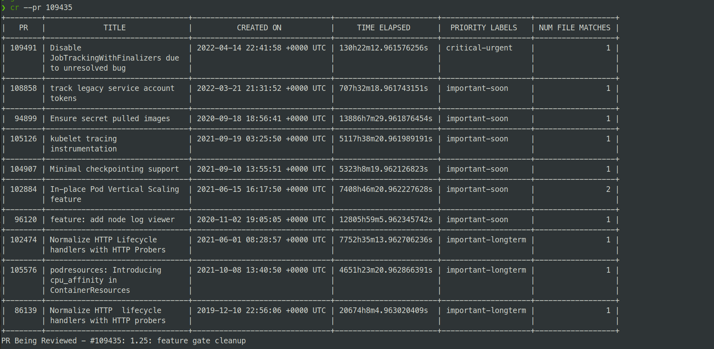

# cr

`cr` is a tool to help `kubernetes/kubernetes` reviewers and approvers better understand
the impact of approving a change. The tool takes in the number of the PR being reviewed and
tabulates what other _open_ PRs exist that are making changes to atleast one of the same
files that the PR under review is making changes to. Additionally, the PRs tabulated are
then expected to have one of these three labels:

- `priority/critical-urgent`
- `priority/important-soon`
- `priority/important-longterm`

The tool was mainly inspired after watching [this](https://youtu.be/32Sm2bHNnCI?list=PL69nYSiGNLP2WfkvTyl3q218f9slpaCkw) video.

For ex:



By having this list of PRs, reviewers could better prioritise what changes should land first
or if changes to a particular part of the codebase should be halted till more reliability work
on it is done.

## Installation

### Pre-requisites

- You will need a [GitHub Personal Access Token](https://docs.github.com/en/authentication/keeping-your-account-and-data-secure/creating-a-personal-access-token)
- After creating one, make the token available through an env variable `GITHUB_TOKEN`:

```sh
export GITHUB_TOKEN="<your token>"
```

### Using the tool

Install:

```
go install github.com/MadhavJivrajani/cr@latest
```

Use:

```
cr --pr <pr number>
```

## Future work

- Right now the tool does exact match of the file paths, having an option to do
  prefix match would be helpful.
- Based on prefix match, we _could_ get test coverage data on the parent packages